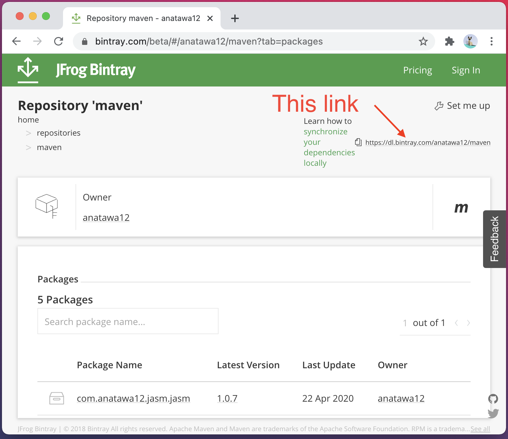

# Bintray2Central

**Because of bintray's changes, This tool will not be working!**

A tool to download files from Bintray and/or upload files to maven repository.

# How to use
First, please install the binary from releases or build yourself and launch the application.

## Download

You can download latest version here.

If you're a windows user, Please download [bintray2central.zip](https://github.com/anatawa12/bintray2central/releases/download/1.1/bintray2central.zip).

If you're a mac user, Please download [bintray2central.app.zip](https://github.com/anatawa12/bintray2central/releases/download/1.1/bintray2central.app.zip).

If you're a linux user, Please download [bintray2central.tar.gz](https://github.com/anatawa12/bintray2central/releases/download/1.1/bintray2central.tar.gz).

## First way: Download files and upload at once

If your resources in bintray repository are compatible with maven central,
You can use this way. If not (e.g. some pom properties are missing), please use
the second way.

1. Enter your bintray repository info to the left up of the gui.
   the url of your bintray repository can be copied from here:
   

1. Enter your credentials for Sonatype account on the right up of the gui. 
   This can be got from ``.gradle/gradle.properties``. 
   To get from `gradle.properties`, click `load from gradle`.

1. Enter your pgp information. This also can be got from `gradle.properties` and
   To get, click `load from gradle`.

1. Click `Upload!` to start uploading

1. Wait until finish and do something on [oss.sonatype.org](oss.sonatype.org)

## Second way: Download files then modify files locally then upload 

If your resources in bintray repository are compatible with maven central,
You can use this way. If not (e.g. some pom properties are missing), please use
the second way.

1. Enter your bintray repository info on the left up of the gui.
   the url of your bintray repository can be copied from here:
   

1. Enter the path to directory that you want to save to 
   on the url field of the right up of the gui.

1. Click `Upload!` to start downloading.

1. On the `Your destination repository is local directory.` dialog, click `NO`.

1. Wait until finish and modify your files locally.

1. Relaunch Bintray2Central

1. Enter the path to directory that you downloaded to
   on the url field of the left up of the gui.

1. Enter your credentials for Sonatype account on the right up of the gui.
   This can be got from ``.gradle/gradle.properties``.
   To get from `gradle.properties`, click `load from gradle`.

1. Enter your pgp information. This also can be got from `gradle.properties` and
   To get, click `load from gradle`.

1. Click `Upload!` to start uploading

1. Wait until finish and do something on [oss.sonatype.org](oss.sonatype.org)

